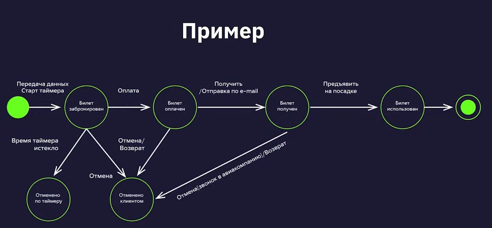
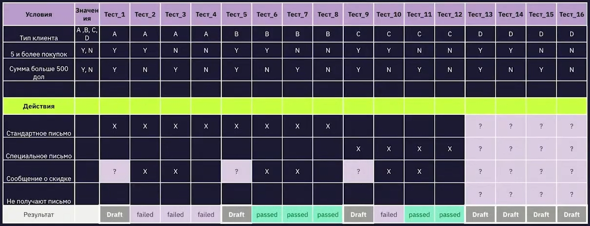

## ТЕХНИКИ ТЕСТ-ДИЗАЙНА

### ОПРЕДЕЛЕНИЕ ТЕСТ-ДИЗАЙНА
* тест-дизайн - **этап тестирования ПО, на котором проектируются и создаются тест-кейсы** в соответствии с определенными ранее критериями качества и целями тестирования
* техники тест-дизайна позволяют создавать наиболее эффективные тест-кейсы
* техники тест-дизайна обеспечивают оптимальное тестовое покрытие при ограниченном количестве проверок

### ЗАЧЕМ НУЖЕН ТЕСТ-ДИЗАЙН
* максимально покрыть требования тестами
* обнаружить самые серьёзные баги
* сократить количество тестов за счёт исключения непродуктивных тест-кейсов
* не пропустить важные тесты

### ТЕХНИКИ ТЕСТ-ДИЗАЙНА
* классы эквивалентности (эквивалентное распределение)
* граничные значения (анализ граничных значений, метод граничных значений)
* попарное тестирование (тестовая комбинаторика)
* тестирование состояний и переходов
* таблицы принятия решений
* исследовательское тестирование
* предугадывание ошибок

### КЛАССЫ ЭКВИВАЛЕНТНОСТИ
* также могут быть использованы названия "эквивалентное распределение", "эквивалентное разделение", "эквивалентное разбиение", "equivalence partitioning"
* класс эквивалентности - входные (а иногда выходные) данные, которые обрабатываются одинаковым образом и приводят к одному результату
* необходимо разделить данные на классы эквивалентности и из каждого класса выбрать хотя бы одно значение для проверки (лучше выбирать значение по середине интервала)
* мы выбираем значения из какой-то группы значений и делаем вывод от том, что все остальные значения из этой группы будут такими же
* данная техника тест-дизайна основана на методе чёрного ящика (то есть у тестировщика нет никакого доступа к коду)
* помогает разрабатывать и выполнять меньше тест-кейсов, при этом сохраняя достаточное тестовое покрытие

### ПРИЗНАКИ ЭКВИВАЛЕНТНЫХ КЛАССОВ
* если один тест выявит ошибку - остальные скорее всего тоже это сделают
* если один из тестов не выявит ошибку - остальные скорее всего тоже этого не сделают

### ЛИНЕЙНЫЕ и НЕЛИНЕЙНЫЕ КЛАССЫ
* линейный класс (диапазон) - слева от диапазона (невалидные значения), диапазон (валидные значения), справа от диапазона (невалидные значения)
* нелинейный класс (набор неупорядоченных данных) - валидные значения, невалидные значения

### ПРИЗНАКИ ЛИНЕЙНЫХ и НЕЛИНЕЙНЫХ КЛАССОВ
* линейный класс - на числовой прямой, упорядоченные множества
* нелинейный класс - не имеют граничных значений, не имеют элементов повышенного риска

### ЧТО МОЖНО РАЗБИТЬ НА КЛАССЫ ЭКВИВАЛЕНТНОСТИ
* числа
* символы
* длину строки
* размер файла
* объём памяти
* разрешение экрана
* версии операционных систем, библиотек
* объём передаваемых данных

### ГРАНИЧНЫЕ ЗНАЧЕНИЯ
* используется для **линейных классов** эквивалентности
* также могут быть использованы названия "анализ граничных значений", "метод граничных значений", "boundary value testing"
* техника анализа граничных значений - проверка поведения продукта (системы или отдельного модуля) на крайних (граничных) значениях входных данных
* граничные значения обязательно следует применять при написании тестов, так как именно в этом месте чаще всего и обнаруживаются ошибки

### АЛГОРИТМ ТЕХНИКИ АНАЛИЗА ГРАНИЧНЫХ ЗНАЧЕНИЙ
* выделить классы эквивалентности
* определить значения этих классов
* определить, к какому классу будет относиться каждая граница
* для каждой границы провести тесты по проверке значения до границы, по ней и сразу после неё
* также можно добавить негативные проверки (например, отрицательные значения, очень большие значения, спецсимволы, символы латиницы и кириллицы)

### ПОПАРНОЕ ТЕСТИРОВАНИЕ
* используется для **нелинейных классов** эквивалентности
* также могут быть использованы названия "тестовая комбинаторика", "pairwise testing"
* попарное тестирование - техника формирования наборов тестовых данных, при которой каждое тестируемое значение каждого из проверяемых параметров хотя бы раз сочетается с каждым из тестируемых значений всех остальных проверяемых параметров
* суть проблемы - если мы попытаемся проверить все сочетания всех значений всех параметров для каждого сложного случая тестирования, мы получим количество тест-кейсов, превышающее все разумные пределы
* суть проблемы - большинство дефектов возникает при комбинации двух параметров
* техника позволяет сократить количество проверок
* техника хорошо масштабируется при увеличении параметров
* техника плохо масштабируется при увеличении количества значений
* если у параметра много значений, то сокращение проверок может быть незначительным, в данном случае имеет смысл разделить значения на 2 класса эквивалентности - валидный (корректные значения) и невалидный (некорректные значения)

### ПРОГРАММЫ ДЛЯ ПОПАРНОГО ТЕСТИРОВАНИЯ
* Pairwise Online Tool
* PICT
* Allpairs
* VPTag

### ТЕСТИРОВАНИЕ СОСТОЯНИЙ И ПЕРЕХОДОВ
* также может быть использовано название "state-transition testing"
* тестирование на основе состояний и переходов применяется для фиксирования требований и описания дизайна приложения, а также помогает выбрать необходимые для проверки кейсы
* описываются конкретные состояния приложения и то, как они могут поменяться

### ЭЛЕМЕНТЫ ДИАГРАММЫ СОСТОЯНИЙ И ПЕРЕХОДОВ
* точка входа - чёрная точка на диаграмме
* переход (transition) (стрелка) - представляет переход из одного состояния в другое, происходящий по событию
* состояние (state) (круг) - состояние приложения, в котором оно ожидает одно или несколько событий
* событие (event) (надпись над стрелкой) - то, что сделал пользователь или другой импульс, который поступил в систему извне
* действие (action) (надпись над стрелкой через / после события) - реакция приложения на событие
* точка выхода - показана на диаграмме как мишень
* условия перехода (transition conditions) (если они есть, добавляются в скобках к событию) - условия, в соответствии с которыми система будет выполнять то или иное действие
* роли пользователей (actors)

### ПРИМЕР ДИАГРАММЫ СОСТОЯНИЙ И ПЕРЕХОДОВ

### ПЛЮСЫ ДИАГРАММ СОСТОЯНИЙ И ПЕРЕХОДОВ
* позволяют визуализировать состояние продукта
* демонстрируют варианты переходов, которые можно пропустить
* помогают отследить дефект, сужая его локацию до конкретного перехода
* показывают внутреннюю механику продукта

### МИНУСЫ ДИАГРАММ СОСТОЯНИЙ И ПЕРЕХОДОВ
* можно пропустить неочевидные переходы
* при слишком сложной структуре продукта диаграммы могут стать громоздкими и запутанными
* являются только основой к применению других методов
* бесполезны при плохом знании продукта

### ТАБЛИЦЫ ПРИНЯТИЯ РЕШЕНИЙ
* также может быть использовано название "decision table"
* таблицы принятия решений используются для тестирования программ со сложной бизнес-логикой
* применимы в случаях, когда есть набор правил, и выходные данные зависят от комбинации этих правил _**(условий)**_
* помогает быстрее разобраться в бизнес-логике приложения, упорядочить её, а также протестировать все возможные комбинации условий
* цель применения - упорядочить и задокументировать сложную логику приложения, протестировать все комбинации условий и состояний

### СУЩНОСТИ, ИЗ КОТОРЫХ СОСТОЯТ ТАБЛИЦЫ ПРИНЯТИЯ РЕШЕНИЙ
* условия (conditions) - короткое описание входных условий (данных), сформулированное в виде вопроса
* действия (actions) - чёткое описание ожидаемого результата, действия системы
* значения (values) - значения, допустимые для входных данных, указанных в условии
* правила (rules) - комбинации входных данных, которые отражены в таблице

### ПЛАН ДЕЙСТВИЙ
* разбить требование на условия
* посчитать количество возможных правил (комбинаций)
* составить таблицу принятия решений
* исключить лишние комбинации, если они есть
* создать тесты

### КОЛИЧЕСТВО ВОЗМОЖНЫХ КОМБИНАЦИЙ
* X = Y1 * Y2 * ... * Yn, где
* X - вычисляемое количество комбинаций
* Y1...Yn - количество вариантов каждого условия
* N - количество условий

### ПРИМЕР ТАБЛИЦЫ ПРИНЯТИЯ РЕШЕНИЙ

### ПЛЮСЫ ТАБЛИЦ ПРИНЯТИЯ РЕШЕНИЙ
* помогают быстро составлять тестовые сценарии
* позволяют выявить неполноту требований
* их можно использовать при отсутствии требований
* можно быстро проверить покрытие требований тест-кейсами
* позволяют предугадать возможные ошибки

### МИНУСЫ ТАБЛИЦ ПРИНЯТИЯ РЕШЕНИЙ
* при большом количестве условий таблицы могут быть громоздкими - их сложно составлять и использовать, а при составлении можно допустить ошибку
* сложность в корректном определении условий, действий и значений при первоначальном проектировании

### ИССЛЕДОВАТЕЛЬСКОЕ ТЕСТИРОВАНИЕ
* также может быть использовано название "exploratory testing"
* исследовательское тестирование - одновременное изучение программы, проектирование и выполнение тестов
* тесты не определены заранее и не выполняются по плану
* это не методика, но подход и образ мысли
* требует подготовки

### ОСОБЕННОСТИ ИССЛЕДОВАТЕЛЬСКОГО ТЕСТИРОВАНИЯ
* не всегда относится к техникам тест-дизайна, но по его результатам также могут составляться тест-кейсы
* исследовательское тестирование - неформальный метод проектирования тестов, при котором тестировщик активно контролирует проектирование тестов во время выполнения
* полученную при тестировании информацию используют для проектирования новых и улучшенных тестов
* исследовательское тестирование - также одновременное изучение программного продукта, проектирование тестов и их исполнение
* исследовательское тестирование - подход, когда тестировщик не использует тест-кейсы, а тестирует приложение по определённому сценарию, который часто составляется прямо во время проверки
* в процессе тестирования выявляются дефекты, и сценарий, который выявил эти дефекты, нужно задокументировать, то есть составить на него тест-кейс, чтобы в дальнейшем проверять, что дефекты исправлены и не появились вновь
* также стоит создать тест-кейсы для похожих сценариев, если они отсутствуют
* также для регрессионного тестирования можно создавать тест-кейсы и в случае, если сценарий не выявил дефекта
* таким образом, исследовательское тестирование позволяет дополнять существующие тестовые наборы новыми тестами, а также составлять актуальные тест-кейсы, которые выявляют дефекты
* помогает исключить парадокс пестицида

### ПРИМЕНЕНИЕ ИССЛЕДОВАТЕЛЬСКОГО ТЕСТИРОВАНИЯ
* быстрая обратная связь о качестве новой функциональности
* быстрое изучение тестируемого продукта
* контроль работы других тестировщиков
* недостаток времени для составления тестовых сценариев
* сценарное тестирование не находит баги и требует разнообразия
* следует принять решение о необходимости покрытия области сценарными тестами
* отсутствие требований
* требования неполные или устарели
* небольшой продукт, для которого не требуется структурированный подход к тестированию (разработка тестовых сценариев займёт больше времени, чем сам процесс тестирования) 
* внезапные изменения в проекте
* дополнительные проверки

### ПЛЮСЫ ИССЛЕДОВАТЕЛЬСКОГО ТЕСТИРОВАНИЯ
* не нужно тратить время на предварительное описание всех сценариев
* не нужна поддержка тестовых сценариев
* не происходит привыкание к тестовым сценариям, и их прохождение не проходит "не глядя"
* не теряется цельное видение продукта
* критические дефекты находятся быстрее
* повышается скорость тестирования
* можно сразу начинать тестировать продукт, даже если требований нет вообще
* исследовательское тестирование интереснее и креативнее (тесты ограничиваются только фантазией и глубиной знаний о продукте)

### МИНУСЫ ИССЛЕДОВАТЕЛЬСКОГО ТЕСТИРОВАНИЯ
* сложно планировать время на проведение тестирования без задокументированных заранее сценариев
* вероятность пропустить ключевые проверки, так как отсутствует ранжирование сценариев по степени важности
* сложность оценки полноты покрытия требования тестами
* требуется высокая квалификация тестировщиков и хорошее знание тестируемого приложения
* сложно использовать для регрессионного тестирования
* невозможно автоматизировать такое тестирование
