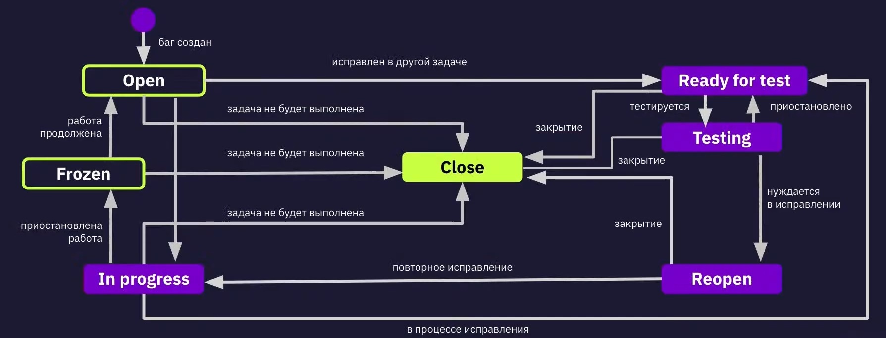

## СОЗДАНИЕ БАГ-РЕПОРТОВ, БАГ-ТРЕКИНГОВЫЕ СИСТЕМЫ, ОТЧЁТЫ О ТЕСТИРОВАНИИ

### ХАРАКТЕРИСТИКИ КАЧЕСТВЕННОГО ПО
* соответствие требованиям - спецификации
* удовлетворение потребностей пользователя

### ДЕФЕКТ (БАГ)
* дефект (баг) - отклонение фактического результата от ожидаемого
* обнаруженные дефекты необходимо документировать

### НА ЧТО ОПИРАЕМСЯ ПРИ ЗАВЕДЕНИИ ДЕФЕКТА
* требования
* спецификации
* технические задания
* предыдущий опыт
* критерии качества
* логика и здравый смысл

### ПРИЧИНЫ ПОЯВЛЕНИЯ ДЕФЕКТОВ
* проблемы в коммуникациях между членами команды
* сложность ПО
* изменение требований
* ошибки программистов
* ошибки тестировщиков

### ЖИЗНЕННЫЙ ЦИКЛ ДЕФЕКТА

### ОТЧЁТ О ДЕФЕКТЕ
* отчёт о дефекте - документ, который описывает шаги воспроизведения дефекта, фактический и ожидаемый результат, серьёзность дефекта и приоритет устранения
* отчёт о дефекте = баг-репорт = баг

### АТРИБУТЫ ОТЧЁТА О ДЕФЕКТЕ
* ID (присваивается автоматически)
* status (статус, присваивается автоматически)
* заголовок
* подробные условия *(опционально)*
* подробное описание *(опционально)*
* предусловие
* шаги воспроизведения
* фактический результат
* ожидаемый результат
* вложение
* окружение (ОС, версия ОС, браузер, версия браузера)
* priority (приоритет, указывает, как быстро надо устранить дефект)
* severity (серьёзность - влияние дефекта на продукт, указывает, насколько баг мешает пользователю)
* assign (на кого назначить данный отчёт)

### ПРАВИЛА ХОРОШЕГО БАГ-РЕПОРТА
* заголовок - краткое описание сути дефекта - что произошло, где произошло и при каких обстоятельствах, до 10 слов
* шаги воспроизведения - точная инструкция по воспроизведению бага, необходимо использовать глаголы в инфинитиве и соблюдать технический стиль изложения, от 2 до 8 шагов
* фактический и ожидаемый результат - один баг - одна пара ФР и ОР
* одна ошибка - один отчёт о дефекте
* краткость - сестра баг-репорта
* писать техническим языком
* прикреплять дополнительные файлы: логи, скрирншоты, видео
* прикреплять ссылки к требованиям
* избегать дубликатов дефектов
* указывать окружение, на котором был обнаружен дефект
* воспроизводить дефект, следуя собственным шагам (должны быть указаны все необходимые шаги, не должно быть лишних шагов)

### ГРАДАЦИИ СЕРЬЁЗНОСТИ БАГА
* блокирующий (blocker) - функция не работает
* критический (critical) - функция работает, но с ограничениями
* значительный (major) - функция работает, но неправильно
* незначительный (minor) - функция работает, но неудобно
* тривиальный (trivial) - функция работает, но не так, как описано в требованиях

### ГРАДАЦИИ ПРИОРИТЕТА
* высокий (high) (1) - устранить немедленно
* средний (medium) (2) - устранить в ближайшее время
* низкий (low) (3) - устранить, когда будет время

### БАГ-ТРЕКИНГОВАЯ СИСТЕМА
* также может быть использовано название "система отслеживания ошибок", "bug tracking system")
* баг-трекинговая система - прикладная программа, созданная для учёта и контроля ошибок и неполадок, пожеланий пользователей, отслеживания устранения ошибок

### ОТЧЁТ О РЕЗУЛЬТАТАХ ТЕСТИРОВАНИЯ
* отчёт о результатах тестирования - документ, который обобщает результаты работ по тестированию и содержит информацию, достаточную для соотнесения текущей ситуации с тест-планом и принятия необходимых управленческих решений

### СОДЕРЖАНИЕ ОТЧЁТА О ТЕСТИРОВАНИИ
* краткое описание (включает основные числовые показатели хода тестирования, главные выводы, рекомендации для дальнейшей работы)
* команда тестировщиков
* описание процесса тестирования
* расписание (календарные сроки выполнения работ)
* статус активностей планирования и прогресс по сравнению с планом
* факторы, препятствующие прогрессу
* статистика по новым дефектам
* список новых дефектов
* статистика по всем дефектам
* качество объекта тестирования (экспертное заключение)
* рекомендации
* приложения
