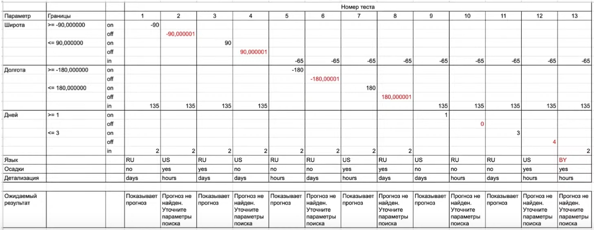

## ГРАНИЧНЫЕ ЗНАЧЕНИЯ И ДОМЕННЫЙ АНАЛИЗ

### ГРАНИЧНЫЕ ЗНАЧЕНИЯ
* используется для **линейных классов** эквивалентности
* также могут быть использованы названия "анализ граничных значений", "метод граничных значений", "boundary value testing"
* техника анализа граничных значений - проверка поведения продукта (системы или отдельного модуля) на крайних (граничных) значениях входных данных
* граничные значения обязательно следует применять при написании тестов, так как именно в этом месте чаще всего и обнаруживаются ошибки

### ОПРЕДЕЛЕНИЕ ГРАНИЧНЫХ ЗНАЧЕНИЙ
* граничное значение (border condition, boundary condition) - значение, которое находится на границе линейного класса эквивалентности, то есть это те значения, которые разделяют линейные классы эквивалентности

### ЗАЧЕМ ТЕСТИРОВАТЬ ГРАНИЧНЫЕ ЗНАЧЕНИЯ
* граничные значения всегда являются элементами повышенного риска, поэтому требуют пристального внимания тестировщика
* помимо границ, тестировать нужно и приграничные значения, то есть лежащие максимально близко слева и справа от границы
* при определении приграничных значений нужно учитывать разрядность чисел, которые используются в программе

### ТИПЫ ЛИНЕЙНЫХ КЛАССОВ ЭКВИВАЛЕНТНОСТИ
* по значению - используется для числовых переменных
* по структуре - длина строки, длина числа, размер файла, объём памяти, прочие характеристики, которые выражаются в числовом эквиваленте

### АЛГОРИТМ ТЕХНИКИ АНАЛИЗА ГРАНИЧНЫХ ЗНАЧЕНИЙ
* для параметра определить классы эквивалентности по значению
* для параметра определить классы эквивалентности по структуре
* найти границы классов
* найти приграничные значения
* протестировать на граничных и приграничных значениях
* также можно добавить негативные проверки (например, отрицательные значения, очень большие значения, спецсимволы, символы латиницы и кириллицы)

### ДОМЕННЫЙ АНАЛИЗ
* техника доменного анализа — это подход, основанный на разбиении диапазона возможных значений параметра (или параметров) на поддиапазоны (или домены), с последующим выбором одного или нескольких значений из каждого домена для тестирования в соответствии с определёнными правилами
* доменное тестирование во многом пересекается с техниками разбиения на классы эквивалентности и анализа граничных значений
* основной принцип доменного анализа - скомбинировать значения на границах и внутри интервалов и таким образом сократить количество тест-кейсов

### ПОНЯТИЯ ДОМЕННОГО АНАЛИЗА
* точка **on** - лежит строго на границе
* точка **off** - лежит слева или справа от границы, то есть точки **on**
* если интервал _**закрыт**_ со стороны точки **on**, то точка **off** лежит вне интервала
* если интервал _**открыт**_ со стороны точки **on**, то точка **off** лежит внутри интервала
* точка **in** - любое значение внутри интервала, ближе к середине

### СОСТАВЛЕНИЕ ТАБЛИЦЫ ДОМЕННОГО АНАЛИЗА

### ШАГ 1
* создадим таблицу и внесём в неё следующие данные
* параметры, для которых есть линейные классы эквивалентности
* для каждого параметра - граничные значения со знаками <, >, <=, >=
* для каждой границы - строки **on**, **off**
* для каждого параметра - значение **in**
* таким образом у нас будет 5 строк для каждого параметра

### ШАГ 2
* заполняем только строки **on** и **off** для всех параметров по диагонали (то есть одной колонке должно быть только одно значение **on** или **off** для одного параметра)

### ШАГ 3
* теперь заполняем значения **in**
* в каждой колонке в итоге должно быть значение **on** / **off** для одного параметра и значение **in** для остальных параметров

### ШАГ 4
* дополним таблицу оставшимися параметрами, которые были предварительно скомбинированы по принципу pairwise
* если комбинаций этих параметров больше, чем количество столбцов, добавляем дополнительные столбцы со значениями **in**, перепроверять значения **on** / **off** не нужно

### ШАГ 5
* выделим красным цветом невалидные значения и добавим ожидаемый результат

### ШАГ 6
* при необходимости можно добавить в таблицу дополнительные негативные проверки
* главное - придерживаться правила: не комбинировать невалидные значения
* один тест - одно невалидное значение, остальные - валидные

### ПРИМЕР ТАБЛИЦЫ ДОМЕННОГО АНАЛИЗА

