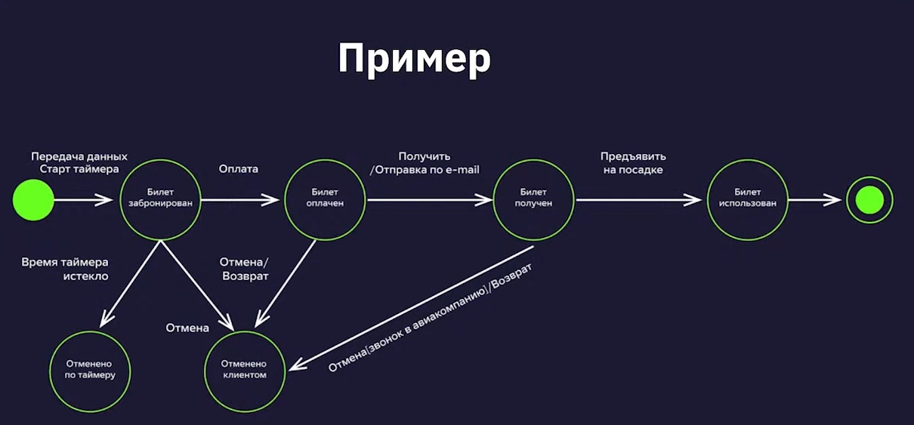

## ДИАГРАММЫ И ТАБЛИЦЫ СОСТОЯНИЙ И ПЕРЕХОДОВ

### ТЕСТИРОВАНИЕ СОСТОЯНИЙ И ПЕРЕХОДОВ
* также может быть использовано название "state-transition testing"
* тестирование на основе состояний и переходов применяется для фиксирования требований и описания дизайна приложения, а также помогает выбрать необходимые для проверки кейсы
* описываются конкретные состояния приложения и то, как они могут поменяться

### ЭЛЕМЕНТЫ ДИАГРАММЫ СОСТОЯНИЙ И ПЕРЕХОДОВ
* точка входа - чёрная точка на диаграмме
* переход (transition) (стрелка) - представляет переход из одного состояния в другое, происходящий по событию
* состояние (state) (круг) - состояние приложения, в котором оно ожидает одно или несколько событий
* событие (event) (надпись над стрелкой) - то, что сделал пользователь или другой импульс, который поступил в систему извне
* действие (action) (надпись над стрелкой через / после события) - реакция приложения на событие
* точка выхода - показана на диаграмме как мишень
* условия перехода (transition conditions) (если они есть, добавляются в скобках к событию) - условия, в соответствии с которыми система будет выполнять то или иное действие
* роли пользователей (actors)

### ПРИМЕР ДИАГРАММЫ СОСТОЯНИЙ И ПЕРЕХОДОВ

### ПЛЮСЫ ДИАГРАММ СОСТОЯНИЙ И ПЕРЕХОДОВ
* позволяют визуализировать состояние продукта
* демонстрируют варианты переходов, которые можно пропустить
* помогают отследить дефект, сужая его локацию до конкретного перехода
* показывают внутреннюю механику продукта

### МИНУСЫ ДИАГРАММ СОСТОЯНИЙ И ПЕРЕХОДОВ
* можно пропустить неочевидные переходы
* при слишком сложной структуре продукта диаграммы могут стать громоздкими и запутанными
* являются только основой к применению других методов
* бесполезны при плохом знании продукта
