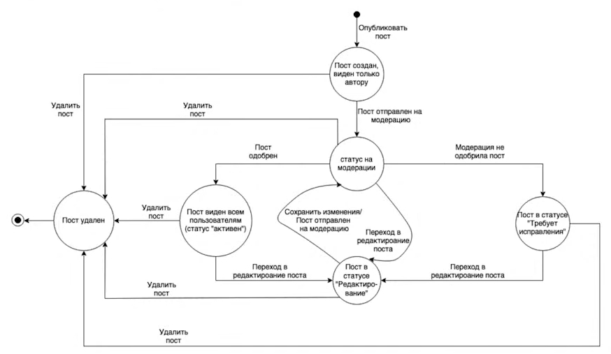

## ДИАГРАММЫ И ТАБЛИЦЫ ПЕРЕХОДОВ СОСТОЯНИЙ

### ТЕСТИРОВАНИЕ СОСТОЯНИЙ И ПЕРЕХОДОВ
* также может быть использовано название "state-transition testing"
* тестирование на основе состояний и переходов применяется для фиксирования требований и описания дизайна приложения, а также помогает выбрать необходимые для проверки кейсы
* описываются конкретные состояния приложения и то, как они могут поменяться

### ДИАГРАММА ПЕРЕХОДОВ СОСТОЯНИЙ
* диаграмма переходов состояний - техника тест-дизайна для систем, которые изменяют характеристики в зависимости от внешних стимулов
* иными словами, система принимает то или иное состояние, в котором находится до тех пор, пока не получит стимул для дальнейшего изменения

### УСТРОЙСТВО ДИАГРАММЫ ПЕРЕХОДОВ СОСТОЯНИЙ
* **точка входа** - пользователь ещё не начал взаимодействие с системой
* **круг с названием состояния** - состояние, в котором система пришла вследствие действий пользователя
* **стрелки** - обозначают переход от одного состояния к другому
* **событие** - то, что приходит в систему извне и запускает изменение состояния _**(пишется над стрелкой)**_
* **действие** - то, что происходит внутри системы из-за смены состояния, следствие события, происходит с событием одновременно _**(пишется над стрелкой, после события, отделяется от события знаком "/")**_
* **точка выхода** - взаимодействие с системой окончено, изменение состояния невозможно

### ЭЛЕМЕНТЫ ДИАГРАММЫ ПЕРЕХОДОВ СОСТОЯНИЙ
* точка входа - чёрная точка на диаграмме
* переход (transition) (стрелка) - представляет переход из одного состояния в другое, происходящий по событию
* состояние (state) (круг) - состояние приложения, в котором оно ожидает одно или несколько событий
* событие (event) (надпись над стрелкой) - то, что сделал пользователь или другой импульс, который поступил в систему извне
* действие (action) (надпись над стрелкой через / после события) - реакция приложения на событие
* точка выхода - показана на диаграмме как мишень
* условия перехода (transition conditions) (если они есть, добавляются в скобках к событию) - условия, в соответствии с которыми система будет выполнять то или иное действие
* роли пользователей (actors)

### ПРИМЕР ДИАГРАММЫ ПЕРЕХОДОВ СОСТОЯНИЙ

### 4 УРОВНЯ ТЕСТОВОГО ПОКРЫТИЯ
* каждое состояние затрагивает хотя бы 1 тест
* каждое событие вызывается хотя бы в 1 тесте
* каждый путь исполняется хотя в 1 тесте *(если в диаграмме есть циклы, то количество возможных путей становится бесконечным; важно тестировать циклы, так как в них могут накапливаться ошибки или происходить утечки памяти)*
* каждый переход используется хотя бы в 1 тесте *(такой уровень тестового покрытия оптимален, так как затронет все состояния, действия и события; в то же время при наличии цикла нет необходимости проверять цикл до бесконечности; такое покрытие может совпадать с покрытием всех возможных путей)*

### ПЛЮСЫ ДИАГРАММ ПЕРЕХОДОВ СОСТОЯНИЙ
* позволяют визуализировать состояние продукта
* демонстрируют варианты переходов, которые можно пропустить
* помогают отследить дефект, сужая его локацию до конкретного перехода
* показывают внутреннюю механику продукта

### МИНУСЫ ДИАГРАММ ПЕРЕХОДОВ СОСТОЯНИЙ
* можно пропустить неочевидные переходы
* при слишком сложной структуре продукта диаграммы могут стать громоздкими и запутанными
* являются только основой к применению других методов
* бесполезны при плохом знании продукта

### ТАБЛИЦА ПЕРЕХОДОВ СОСТОЯНИЙ
* таблицы переходов состояний лучше систематизируют сведения о системе
* они состоят из 4 колонок: текущее состояние, событие, действие, новое состояние
* при составлении таблицы **все** состояния сопоставляются со **всеми** событиями
* поэтому таблица переходов состояний в отличие от диаграммы учитывает комбинации состояний и событий, которые в диаграмме напрямую не связаны

### АЛГОРИТМ СОСТАВЛЕНИЯ ТАБЛИЦЫ ПЕРЕХОДОВ СОСТОЯНИЙ
* сопоставить состояния и события по принципу "все ко всем" и заполнить столбцы "Текущее состояние", "Событие"
* там, где смена состояния вызывает действие - заполнить столбец "Действие"
* комбинации состояния и действия (если отсутствует событие, но есть действие) добавляем только, если состояние и действие напрямую связаны
* в каждой строке указать новое состояние; если событие не ведёт к смене состояния, то новое состояние совпадает с текущим

### АЛГОРИТМ СОСТАВЛЕНИЯ ТЕСТОВ ПО ТАБЛИЦЕ ПЕРЕХОДОВ СОСТОЯНИЙ
* выделить зелёным все возможные переходы (они отражены в диаграмме)
* выделить невозможные переходы, которые несут риски и выделить их красным; это будут негативные проверки; для выявления рисков тестировщики советуются с разработчиками или аналитиками
