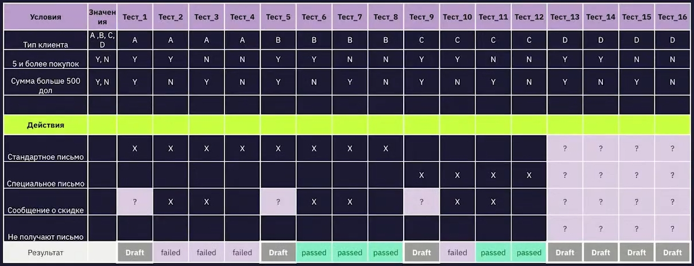

## ТАБЛИЦЫ ПРИНЯТИЯ РЕШЕНИЙ

### ТАБЛИЦЫ ПРИНЯТИЯ РЕШЕНИЙ
* также может быть использовано название "decision table"
* таблицы принятия решений используются для тестирования программ со сложной бизнес-логикой
* применимы в случаях, когда есть набор правил, и выходные данные зависят от комбинации этих правил _**(условий)**_
* помогает быстрее разобраться в бизнес-логике приложения, упорядочить её, а также протестировать все возможные комбинации условий
* цель применения - упорядочить и задокументировать сложную логику приложения, протестировать все комбинации условий и состояний

### СУЩНОСТИ, ИЗ КОТОРЫХ СОСТОЯТ ТАБЛИЦЫ ПРИНЯТИЯ РЕШЕНИЙ
* условия (conditions) - короткое описание входных условий (данных), сформулированное в виде вопроса
* действия (actions) - чёткое описание ожидаемого результата, действия системы
* значения (values) - значения, допустимые для входных данных, указанных в условии
* правила (rules) - комбинации входных данных, которые отражены в таблице

### АЛГОРИТМ СОСТАВЛЕНИЯ ТАБЛИЦЫ ПРИНЯТИЯ РЕШЕНИЙ
* выписать в таблицу все условия и действия
* определить количество столбцов; чтобы посчитать количество столбцов в таблице, нужно перемножить количество вариантов для каждого условия
* заполнить первое условие; первым идёт условие с наибольшим количеством вариантов
* заполняем остальные условия
* заполнить действия

### ПЛАН ДЕЙСТВИЙ
* разбить требование на условия
* разбить каждое условие на  варианты (классы эквивалентности)
* посчитать количество возможных правил (комбинаций)
* составить таблицу принятия решений
* исключить лишние комбинации, если они есть
* создать тесты

### КОЛИЧЕСТВО ВОЗМОЖНЫХ КОМБИНАЦИЙ
* X = Y1 * Y2 * ... * Yn, где
* X - вычисляемое количество комбинаций
* Y1...Yn - количество вариантов каждого условия
* N - количество условий

### ПРИМЕР ТАБЛИЦЫ ПРИНЯТИЯ РЕШЕНИЙ

### ПЛЮСЫ ТАБЛИЦ ПРИНЯТИЯ РЕШЕНИЙ
* помогают быстро составлять тестовые сценарии
* позволяют выявить неполноту требований
* их можно использовать при отсутствии требований
* можно быстро проверить покрытие требований тест-кейсами
* позволяют предугадать возможные ошибки

### МИНУСЫ ТАБЛИЦ ПРИНЯТИЯ РЕШЕНИЙ
* при большом количестве условий таблицы могут быть громоздкими - их сложно составлять и использовать, а при составлении можно допустить ошибку
* сложность в корректном определении условий, действий и значений при первоначальном проектировании
