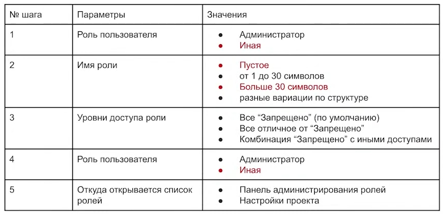
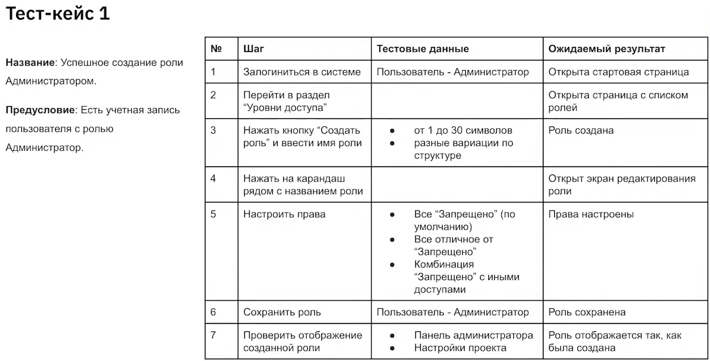
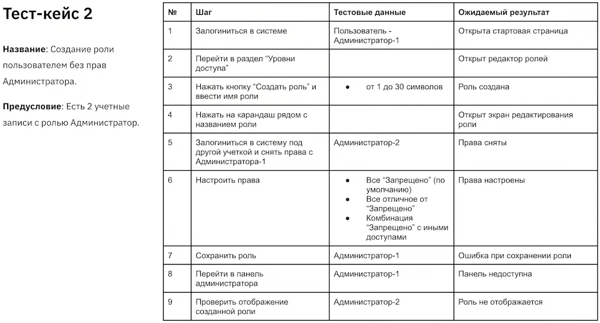
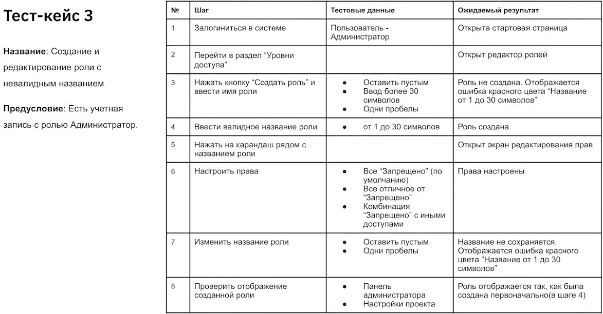

## ТЕСТИРОВАНИЕ ПО ПОЛЬЗОВАТЕЛЬСКИМ СЦЕНАРИЯМ

### ПОЛЬЗОВАТЕЛЬСКИЙ СЦЕНАРИЙ
* также могут быть использованы названия "сценарий использования", "use case"
* пользовательский сценарий - сценарий, по которому пользователь взаимодействует с приложением, программой для выполнения действия или для достижения цели
* может проводиться как часть приёмочного тестирования
* пользовательский сценарий описывает взаимодействия участников. как правило, пользователя и системы
* количество участников - от 2 и больше
* пользователь - человек или другая система
* пользовательский сценарий может содержать следующие разделы: действующие лица, цель, предусловие, успешный сценарий (пошагово), результат

### ФОРМЫ ПОЛЬЗОВАТЕЛЬСКИХ СЦЕНАРИЕВ
* список шагов
* таблица с основными и альтернативными сценариями
* диаграмма вариантов использования
* диаграмма классов

### ДИАГРАММА ВАРИАНТОВ ИСПОЛЬЗОВАНИЯ
* диаграмма вариантов использования - концептуальное представление системы в процессе проектирования и разработки
* состоит из актёров, вариантов использования и отношений между ними
* актёр (действующее лицо, актант, актор) - любой субъект, объект или система, взаимодействующая с моделируемой системой извне: изображается в виде человечка, произвольной иконки, класса с текстовым стереотипом "actor"
* вариант использования - спецификация сервисов (функций), которые система представляет актёру; обозначается эллипсом 
* диаграмма составляется в соответствии с нотацией UML

### АЛГОРИТМ СОСТАВЛЕНИЯ ТЕСТ-КЕЙСОВ ПО ПОЛЬЗОВАТЕЛЬСКИМ СЦЕНАРИЯМ
* определить, какие параметры влияют на выполнение каждого шага
* с помощью техник тест-дизайна выявить значения параметров, разделить их на валидные и невалидные
* скомпоновать параметры и представить в виде одного или нескольких тест-кейсов
* сначала составляем позитивный сценарий, а потом - негативные

### ПРИМЕР ПОЛЬЗОВАТЕЛЬСКОГО СЦЕНАРИЯ
* как администратор системы, перехожу в раздел Уровни доступа
* создаю новую роль
* выбираю уровень доступа для каждого пункта (по умолчанию уровень доступа - запрещено)
* сохраняю роль
* роль доступна в списке проектных ролей

### ПРИМЕР ТАБЛИЦЫ С ПАРАМЕТРАМИ И ЗНАЧЕНИЯМИ

### ПРИМЕР СПИСКА ТЕСТ-КЕЙСОВ
* успешное создание роли администратором *(позитивный сценарий)*
* создание роли пользователем без прав администратора *(негативный сценарий)*
* создание роли с невалидным названием / изменение названия на невалидное *(негативный сценарий)*

### ПРИМЕР ТЕСТ-КЕЙСА С ПОЗИТИВНЫМ СЦЕНАРИЕМ

### ПРИМЕР ТЕСТ-КЕЙСА С НЕГАТИВНЫМ СЦЕНАРИЕМ

### ПРИМЕР ТЕСТ-КЕЙСА С НЕГАТИВНЫМ СЦЕНАРИЕМ

