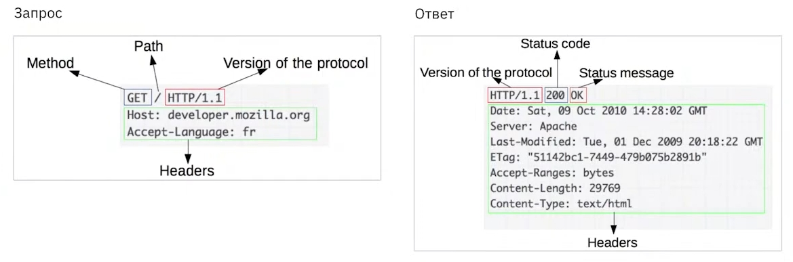

## КЛИЕНТ-СЕРВЕРНАЯ АРХИТЕКТУРА

### КЛИЕНТ-СЕРВЕРНАЯ АРХИТЕКТУРА
* клиент-серверная архитектура - вычислительная или сетевая архитектура, в которой сетевая нагрузка распределена между поставщиками услуг **(серверы)** и заказчиками услуг **(клиенты)**
* клиент - пользователь сервиса, который обращается к серверу для получения какой-то информации (*пример клиента*: приложение, веб-приложение, мобильное приложение)
* сервер - место, где располагается веб-приложение или его серверная часть

### БАЛАНСИРОВЩИКИ
* балансировщик нагрузки (load balancer) - сервис, который помогает серверам эффективно перемещать данные, оптимизирует использование ресурсов доставки приложений и предотвращает перегрузки
* функции балансировщика - разгрузка, прогнозная аналитика, запуск новых виртуальных хранилищ

### ВИДЫ КЛИЕНТ-СЕРВЕРНОЙ АРХИТЕКТУРЫ
* двухзвенная (двухуровневая) архитектура - клиент, сервер
* трёхзвенная (трёхуровневая) архитектура - клиент, веб-сервер, сервер с базой данных
* многозвенная архитектура - клиент, несколько серверов
* монолитная архитектура - приложение представлено в виде единого компонента и представляет собой разрез модульно прошитой бизнес-логики; все клиенты, как правило, обращаются к одному серверу, на котором находится и база данных, и файловое хранилище
* микросервисная архитектура - подход к созданию приложения, подразумевающий отказ от единой, монолитной структуры

### ПРИНЦИП РАБОТЫ API
* API (application programming interface) - программный интерфейс приложения - контракт общения между клиентов и сервером
* контракт включает в себя: саму операцию, которую мы можем выполнить; данные, которые поступают на вход; данные, которые оказываются на выходе (содержание данных или сообщение об ошибке)
* такой подход позволяет большому количеству физических клиентских устройств и типов приложений взаимодействовать с данным приложением
* один API можно использовать не только для вычислений на базе ПК, но также для мобильных телефонов

### ТИПЫ API
* SOAP (simple object access protocol) - простой протокол доступа к объектам; стандартизированный API с высоким уровнем безопасности, в основном используется в различных банковских приложениях; формат общения клиента и сервера - XML
* REST API (representational state transfer) - передача состояния представления; самый распространённый формат API; в отличие от SOAP является архитектурным стилем, а не протоколом, это согласованный набор параметров и значений; формат общения клиента и сервера - JSON
* GraphQL - язык запросов для получения данных через API; не специфичен для одной платформы и работает для всех типов клиентов; формат общения клиента и сервера - query language
* gRPC (remote procedure call) - система удалённого доступа процедур; актуальный фреймворк для разработки масштабируемых, современных и быстрых API; впервые представлена корпорацией Google в 2015 году

### ПРОТОКОЛЫ HTTP / HTTPS
* HTTP - простой протокол, используемый для передачи содержимого в интернете; подключение в HTTP устанавливается по стандартному TCP-порту 80
* HTTPS - безопасная версия протокола HTTP, которая реализует протокол HTTP с использованием протокола TLS для защиты базового TCP-подключения; подключение в HTTPS устанавливается по TCP-порту 443

### ЗАПРОСЫ И ОТВЕТЫ
* запросы - сообщения, отправленные клиентом (обычно веб-браузером)
* ответы - сообщения, отправленные сервером

### ОСНОВНЫЕ АСПЕКТЫ HTTP
* HTTP - прост
* HTTP - расширяем
* HTTP - не имеет состояния, но имеет сессию

### HTTP-ПОТОК
* открытие TCP-соединения
* отправка HTTP-сообщения
* чтение ответа
* закрытие или переиспользование соединения для дальнейших запросов

### ПРИМЕР ЗАПРОСА И ОТВЕТА

### SWAGGER
* Swagger - фреймворк для спецификации REST API
* основная задача - просматривать необходимые параметры, которые должны передаваться в запросах и ответах
* позволяет интерактивно работать с запросами (выполнять запросы, смотреть ответы)
* представлена детализация по эндпоинтам и методам
