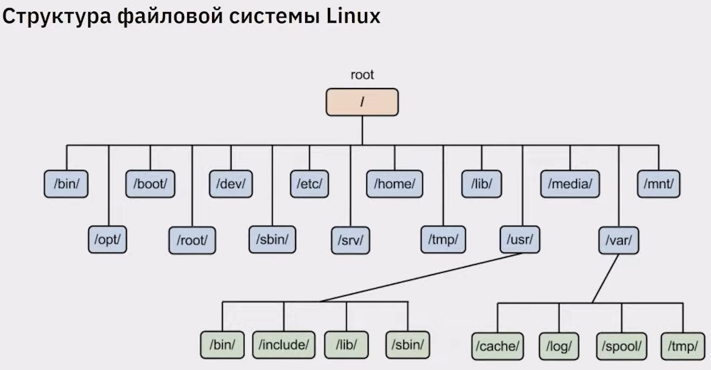

## ОСНОВЫ LINUX

### РАБОТА С ТЕРМИНАЛОМ
* clear - очистить экран от содержимого; также ctrl + L
* ls - показать файлы в папке
* ls -l - показать файлы в папке с указанием подробной информации
* ls -al - показать файлы (включая скрытые) в папке с указанием подробной информации
* cd - открыть папку (указать название папки)
* cd .. - открыть родительскую папку
* cd / - открыть корневую папку
* touch - создать новый файл (указать название файла и при необходимости указать расширение)
* sudo su - запуск команды в режиме суперпользователя
* exit - выход из режима суперпользователя
* sudo reboot - перезагрузка системы
* ip a - вызов информации об IP-адресе
* клавиши crtl + shift + "+/-" - изменение масштаба
* клавиши ctrl + shift + x - сохранение изменений
* клавиша tab - дозаполнить текст, который вы недописали
* клавиши ВВЕРХ и ВНИЗ - перебор значений, которые мы вводили недавно
* клавиша q - выход в режим ввода, если он недоступен
* несколько команд можно объединить знаком &&, например, touch 1.rb && git add 1.rb && git commit -m "Commit 1"

### СТРУКТУРА ФАЙЛОВОЙ СИСТЕМЫ LINUX

### КАТАЛОГИ
* структура каталогов относится к стандарту **FHS** (Filesystem Hierarchy Standard)
* **/** - корневой каталог, содержащий всю файловую иерархию
* **/bin** - основные утилиты, необходимые как в однопользовательском режиме, так и при обычной работе всем пользователям (например: cat, ls, cp)
* **/boot** - загрузочные файлы (в том числе файлы загрузчика, ядро, initrd, System.map); часто выносится на отдельный раздел
* **/dev** - основные файлы устройств (например, /dev/null, /dev/zero)
* **/etc** - общесистемные конфигурационные файлы (имя происходит от лат. et cetera)
* **/home** - содержит домашние каталоги пользователей, которые в свою очередь содержат персональные настройки и данные пользователя; часто размещается на отдельном разделе
* **/lib** - основные библиотеки, необходимые для работы программ из /bin и /sbin
* **/media** - точки монтирования для сменных носителей
* **/mnt** - содержит временно монтируемые файловые системы
* **/opt** - дополнительное программное обеспечение
* **/proc** - виртуальная файловая система, представляющая состояние ядра операционной системы и запущенных процессов в виде файлов
* **/root** - домашний каталог пользователя root
* **/run** - информация о системе с момента её загрузки, в том числе данные, необходимые для работы демонов (pid-файлы, UNIX-сокеты и т.д.)
* **/sbin** - основные системные программы для администрирования и настройки системы, например, init, iptables, ifconfig
* **/srv** -  данные для сервисов, предоставляемых системой (например, www или ftp)
* **/sys** - содержит информацию об устройствах, драйверах, а также некоторых свойствах ядра
* **/tmp** - временные файлы (см. также /var/tmp)
* **/usr** - вторичная иерархия для данных пользователя; содержит большинство пользовательских приложений и утилит, используемых в многопользовательском режиме; может быть смонтирована по сети только для чтения и быть общей для нескольких машин
* **/usr/bin** - дополнительные программы для всех пользователей, не являющиеся необходимыми в однопользовательском режиме
* **/usr/lib** - библиотеки для программ, находящихся в /usr/bin и /usr/sbin
* **/usr/local** - третичная иерархия для данных, специфичных для данного хоста; обычно содержит такие подкаталоги, как bin, lib, share
* **/usr/sbin** - дополнительные системные программы (такие как демоны различных сетевых сервисов)
* **/var** - изменяемые файлы, такие как файлы регистрации, временные почтовые файлы, файлы спулеров
* **/var/lib** - информация о состоянии; постоянные данные, изменяемые программами в процессе работы (например, базы данных, метаданные пакетного менеджера и др.)
* **/var/log** - различные файлы журналов (логи)
* важно заметить, что при установке ПО размещается сразу в нескольких каталогах: исполняемые файлы в /bin, настройки в /etc/ и так далее; поэтому важно использовать пакетные менеджеры для управлением ПО в Linux

### УСТАНОВКА ПАКЕТОВ
* установить ПО можно с помощью пакетного менеджера **apt**
* формат команды установки пакета - sudo apt install {название пакета}
* команда синхронизации списка пакетов - sudo apt update
* команда обновления пакетов до последних версий - sudo apt upgrade
* команда установки файлового менеджера Midnight Commander - sudo apt install mc
* команда установки сервера OpenSSH - sudo apt install openssh-server

### SSH
* основным способом управления сервером является подключение по протоколу SSH (Secure SHell)
* этот протокол позволяет удалённо и безопасно подключаться к системе для управления через оболочку; безопасность достигается за счет сквозного шифрования данных сеанса
* sudo systemctl enable --now ssh - включение OpenSSH
* sudo systemctl status ssh - оценка статуса OpenSSH
* ssh username@ip-address/hostname - подключение к SSH-серверу
* sudo systemctl disable ssh --now - отключение OpenSSH
